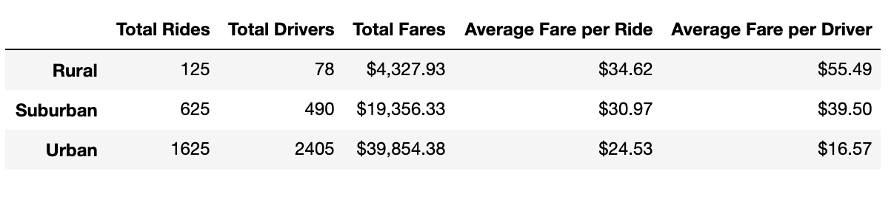

# PyBer_Analysis

## Overview of Analysis
This assignment analyzed ride-sharing data to find trends and averages in ride fare between city type. The city types considered were urban, suburan, and rural. We created a summary DataFrame comparing total fares for each city type. Then we constructed a line chart to visualize total weekly ride fares between the city types. 

## Rideshare Data Analysis Results
Based on the Summary DataFrame, Rural areas take the least amount of rides (125). Suburban areas get five times as many rides at 625 and Urban areas use ride-sharing the most at 1625 rides within. Total drivers showed the same trend. There were far less Rural and Suburban drivers than urban drivers. It is important to note that Rural and Suburban city types had less drivers than total rides while the Urban city type had more total drivers than total rides. There were 2405 registered drivers but only 1625 total rides in urban areas.  

Total Fares between the three city types followed a similar pattern. Rural had the least total fare at $4,327.93. Suburban city types had over four times the total fare at $19,356.33. Urban cities took the top place with almost double the total fares of Urban cities at $39,854.38. 

This pattern changes when we calculated ride and driver averages between the three data types. Average fare per ride AND average fare per driver are higher in rural areas at $34.62 and $55.49, respectively. These averages drop drastically to $24.53 and $16.57 in Urban Areas, respectively. Please view the DataFrame below:

  

## Summary and Recommendations
With the DataFrame build and the analysis complete, it is now time to make recommendations to lessen disparities in numbers among the three city types.  

1. As mentioned in the analyssi. Urban areas have more total drivers than total rides. This indicates that there is an opportunity for you to build more demand to meet supply. Consider adding a monthly ride subscription program so that consumers feel more committed to your brand and your drivers feel more secure with your company.  

2. Build discounted pricing for rural and suburban areas to build demand and facilitate buy-in from those consumers. There are significantly less total rides and total rides in rural and suburban city types and average Fares (both per ride and per Driver) are much higher for these areas. Shorten the barrier for consumer entry by offering temporary (1 month) discounted rides so that potential customers can feel the convenience!

3. Consider differing rider behavior and needs. Urban populations typicallly need rides for shorter distances but utilize ride-sharing services more often. This keeps drivers busy and conveniently located. Suburban and Rural areas might need longer distance rides. That should not be a turn off because longer distance rides cost more. Create a marketing campaign to push consumers to select ride-sharing over taxi drivers. Encourage people in suburban and rural areas to participate as drivers to build a larger supply to meet the demand.   

Please view the line chart that visualizes these disparities below: 
  

